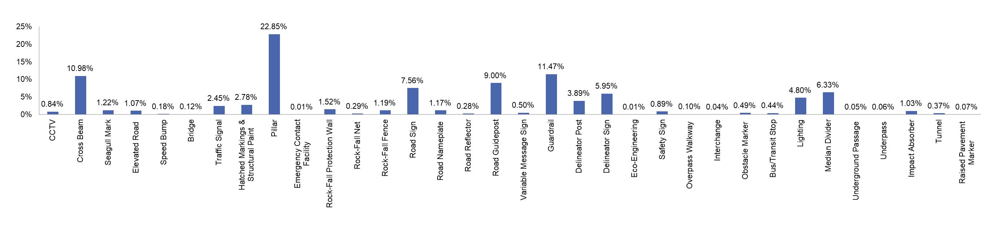
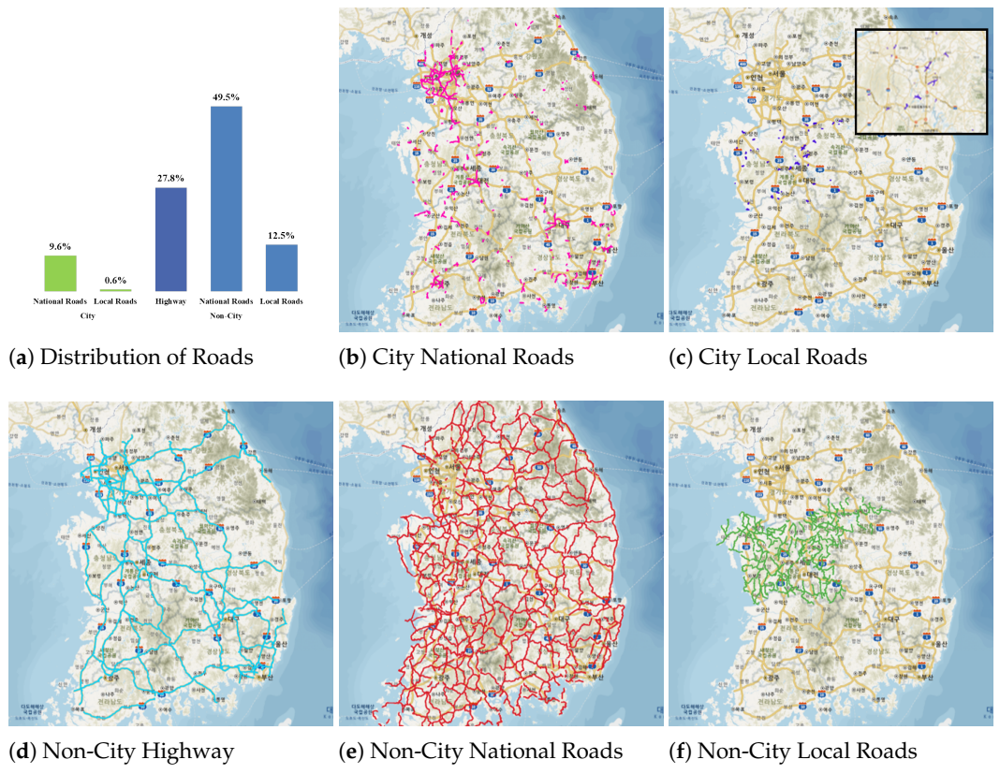
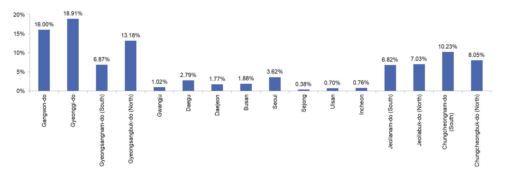

# Large-Scale Nationwide Korean Road Infrastructure Dataset

[](https://drive.google.com/file/d/1BAdLggaiQaVZGeg28dY7paguXNcEV-lX/view?usp=drive_link)
[-blue?style=for-the-badge&logo=databricks)](https://drive.google.com/file/d/1BAdLggaiQaVZGeg28dY7paguXNcEV-lX/view?usp=drive_link)
[](https://forms.gle/HFojMyLaLR9CSA6Q7)


This repository provides a comprehensive dataset of road infrastructure across various regions of South Korea. Below, you can find details on how to access sample data, cite the dataset, and read our accompanying paper. _**"Large-Scale Nationwide Korean Road Infrastructure Dataset for Comprehensive Road Facility Recognition for Comprehensive Road Facility Recognition"**_


---

## Abstract
This paper presents a large-scale, nationwide Korean road infrastructure dataset designed to support robust AI-driven road facility recognition. We collected over two million high-resolution (3328×1872) frames using nine survey vehicles equipped with camera and GPS sensors, covering a diverse range of highways, national roads, and local roads across both city and non-city regions. From this, we refined 200,000 frames, annotating 2,676,583 instances spanning 34 facility types—19 requiring bounding boxes (e.g., traffic signals, delineator signs) and 15 necessitating polygon-based segmentation (e.g., guardrails, tunnels). Rigorous quality assurance measures were implemented, including de-identification of personal data and a two-layer annotation review process. Benchmark experiments with YOLO v4 and YOLO v5 demonstrated a bounding-box mAP of 70.57\% and a segmentation mAP of 60.20\%, underscoring the dataset’s utility for complex road infrastructure tasks. By encapsulating a wide variety of environmental contexts and facility types, this dataset enables advanced applications in road safety asset management, intelligent transportation systems, and autonomous driving research. Furthermore, the dataset has been made publicly accessible via AI Hub (https://www.aihub.or.kr/), fostering broader innovation and collaboration in the AI community.

---

## Introduction
We collected over two million high-resolution (3328×1872) frames using nine survey vehicles equipped with camera and GPS sensors. From these, 200,000 frames were refined and annotated with:
- **34 distinct facility types** (e.g., traffic signals, guardrails, tunnels, etc.)

- **2,676,583 labeled instances** (bounding boxes and polygon annotations)
- Coverage of **highways, national roads, and local roads** in both **city and non-city** areas


The dataset supports tasks such as object detection and segmentation, aiming to advance road safety asset management, intelligent transportation systems, and autonomous driving research.

---

## Sample Dataset Download
We have provided a **480MB** sample dataset for quick exploration.

- **[Download Sample Dataset (Google Drive)](https://drive.google.com/file/d/1BAdLggaiQaVZGeg28dY7paguXNcEV-lX/view?usp=drive_link)**

This sample includes a subset of images and annotations (bounding boxes + polygons), along with a JSON file. 

---

## Paper
For more details on our methodology, data acquisition, annotation guidelines, and benchmark experiments, please refer to our paper:

- **[View Full Paper (PDF)](Now Under Review)**

Topics covered:
- Data collection procedure (vehicles, cameras, GPS time sync)
- Annotation quality control and labeling guidelines
- Example deep learning experiments with YOLO v4 (bounding box) and YOLO v5 (segmentation)
- Results, analysis, and future directions

---
## Full Data Download Request
In order to access our dataset, you must first agree to the terms and conditions by completing a brief survey provided [here](https://forms.gle/HFojMyLaLR9CSA6Q7). You will receive the download link shortly after the approval process is completed.

---

## License
This dataset is released under the Creative Commons Attribution-NonCommercial-ShareAlike **(CC-BY-NC-SA)** license. 
This means you are free to share and adapt this dataset, under the following conditions:
- Attribution: You must give appropriate credit, provide a link to the license, and indicate if changes were made.
- NonCommercial: You may not use the material for commercial purposes.
- ShareAlike: If you remix, transform, or build upon the dataset, you must distribute your contributions under the same license as the original.

For more detailed information on what is permitted and what is not, please refer to the official Creative Commons license summary.

---

## Citation
If you use this dataset or any subset in your research, please cite:
```
@misc{kim2025road,
  title   = {Large-Scale Nationwide Korean Road Infrastructure Dataset 
             for Comprehensive Road Facility Recognition},
  author  = {Kim, Hyeongbok and Kim, Eunbi and Ahn, Sanghoon and Kim, Beomjin 
             and Kim, Sung Jin and Sung, Tae Kyung and Zhao, Lingling 
             and Su, Xiaohong and Dong, Gilmu},
  year    = {2025},
}
